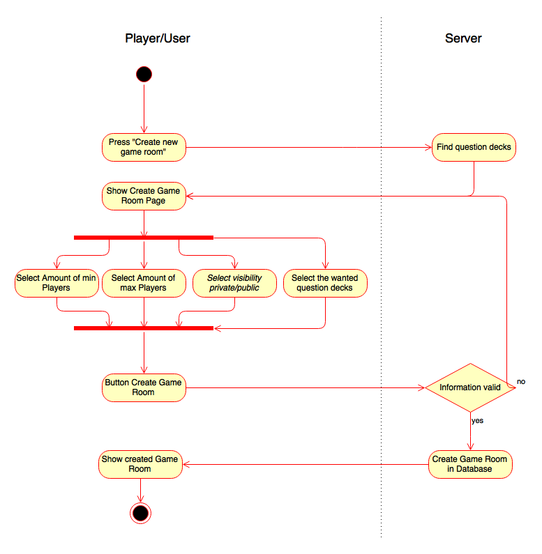
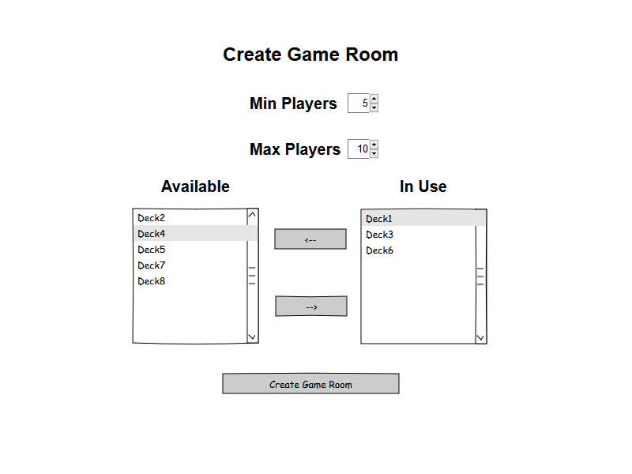

Fact Racing
# Use Case Specification: Create game room
 
# Revision History

|Date       | Version |	Description   |	Author          |
|-----------|---------|---------------|-----------------|
|03/11/2016 |	1.0     |	Initial draft | Janik Ritz |

# Table of Contents

1. Use-Case Name  
    1.1 Brief Description  
2. Flow of Events  
    2.1 Basic Flow  
    2.2 Alternative Flows  
3. Special Requirements  
    3.1 Actual Browser  
    3.2 Internet Connection  
4. Preconditions  
    4.1 Name  
5. Postconditions  
    5.1 One new game room created  
    5.2 No new game room created  
6. Extension Points 

### 1.  Use-Case Name
#### 1.1 Brief Description
This use-case allows the player/user to create a custom game room with selected question decks.
For this use-case exists a fitting .feature [file](../../../src/test/resources/com/factracing/cucumber/CreateGameRoom.feature) written in Cucumber with tests for all Flows.
### 2. Flow of Events
#### 2.1 Basic Flow
The Basic Flow Diagram:

A Screenshot/Mockup of what this use case could look:

#### 2.2 Alternative Flows
Currently not applicable to this use case.

### 3. Special Requirements
Minimum Screen Size of 600x800.
Browser with HTML5 support. 

### 4. Preconditions
#### 4.1 Name
 The User and his current session has a name.

### 5.  Postconditions
#### 5.1 One new game room created
A new entry in the database with the information of used decks, playing player, minimum and maximum amount of players in the game room

#### 5.2 No new game room created
No change in the database. Showing pages depending on the way out of creating game room.

### 6. Extension Points
(n/a)
